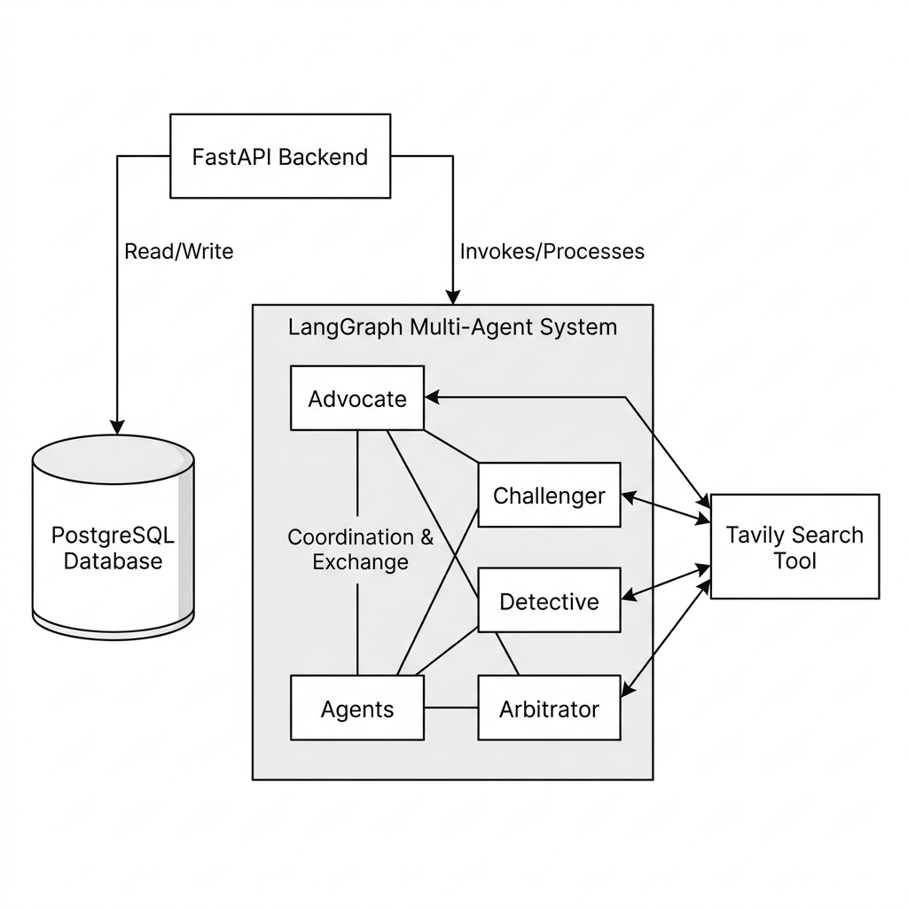
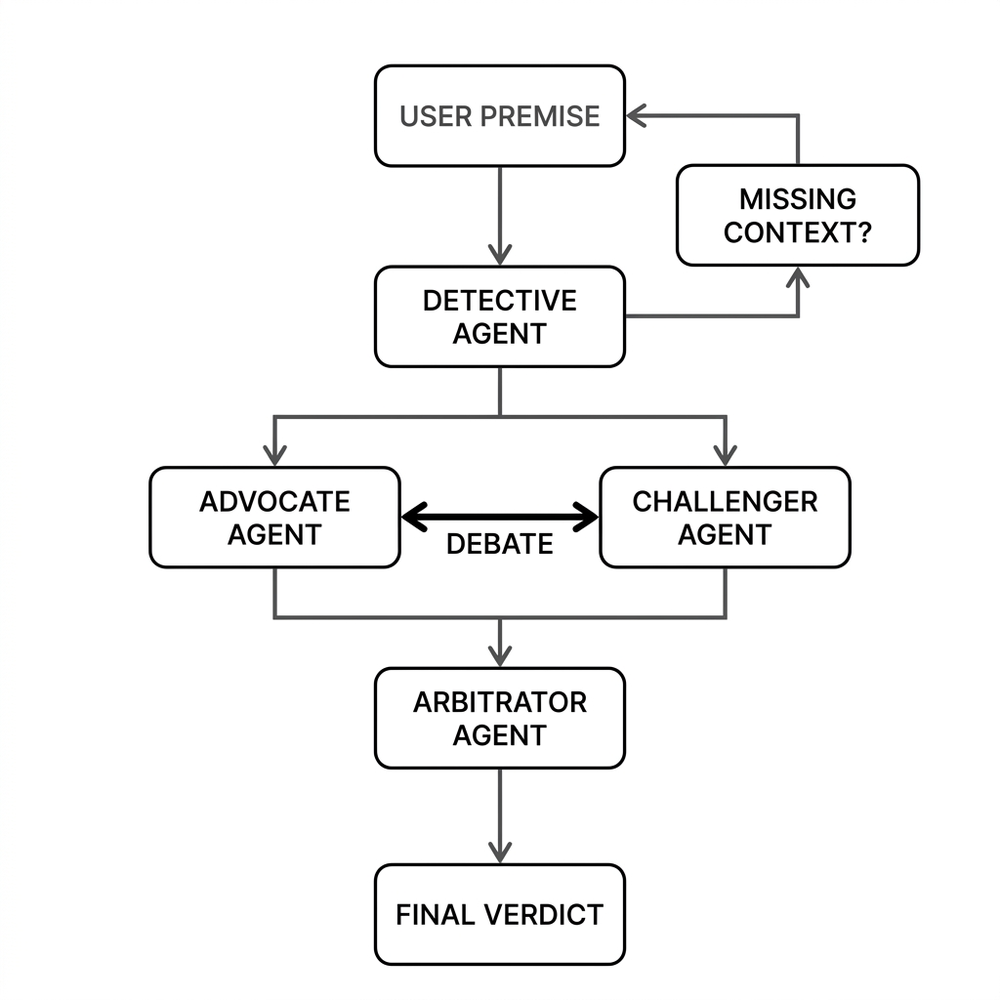
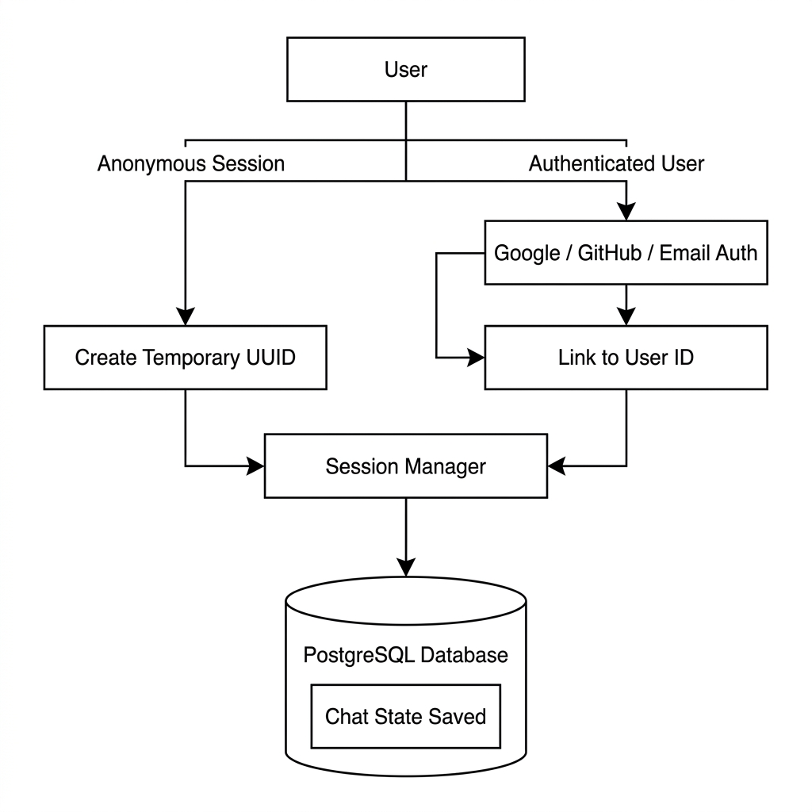

# Aletheox Architecture

This document provides a detailed breakdown of the architecture, technical stack, authentication flow, and agent interactions within the Aletheox multi-agent decision engine. Aletheox is built on a decoupled architecture, separating the multi-agent workflow from the API layer and the frontend.

## 1. High-Level Architecture 

The system relies on an asynchronous backend to handle heavy LLM logic, a PostgreSQL database for durable state persistence, and a lightweight, fast frontend.

---

## 2. The AI & Agent Workflow

The core of Aletheox is the multi-agent debate system, orchestrated using **LangGraph**. The workflow is designed to pressure-test ideas objectively.

### The Agents

1.  **The Advocate (The Proponent):** Takes the user's premise and constructs compelling, logically sound arguments highlighting potential benefits. It is strictly constrained by a zero-hallucination policy and grounded in real-world facts.
2.  **The Challenger (The Skeptic):** Pressure-tests the premise by identifying hidden risks, structural flaws, and opportunity costs. It acts as a grounded risk-manager, avoiding blind pessimism.
3.  **The Detective (The Context Gatherer):** Runs in parallel to identify missing context. If variables are unknown, the Detective halts the debate and asks the user specifically targeted questions to eliminate ambiguity.
4.  **The Arbitrator (The Judge):** Acts as the final authority using an LLM-as-a-judge approach. It reviews the full transcript, weighs the arguments of the Advocate and Challenger, factors in the Detective's context, and delivers a definitive verdict (Proceed, Pivot, or Abandon).

### Tools Used
*   **Tavily Search:** An external API provided to the Advocate and Challenger, allowing them to search the web in real-time. This ensures that arguments regarding salaries, benchmarks, or modern trends are completely factual.

### Agent Workflow Diagram

Below is the cyclical execution flow of the agents within LangGraph. The graph supports pause-and-resume breakpoints for human-in-the-loop interactions (e.g., when the Detective asks a question).

---

## 3. Backend & Orchestration Layer

The backend is built using modern Python frameworks to handle the stateful, asynchronous nature of agentic AI.

*   **FastAPI:** Exposes the LangGraph execution through clean asynchronous REST APIs. FastAPI handles the separation of concerns, ensuring the UI does not directly couple with the AI logic.
*   **LangGraph:** Manages the cyclical, stateful communication between agents. It acts as the orchestrator.
*   **PostgreSQL:** Serves as the memory and persistence layer. Instead of just storing chat messages, it stores the complete state of the LangGraph at every node execution, allowing the system to durably track sessions and resume interrupted workflows.
*   **Package Management:** The backend utilizes `uv` for lightning-fast, reproducible dependency management (`pyproject.toml` and `uv.lock`).

---

## 4. Flexible Authentication Flow

Aletheox features a flexible, hybrid authentication system designed to lower the barrier to entry while allowing power users to save their data.

### Authentication Mechanisms
1.  **Anonymous/Guest Mode:** Users can jump straight into the application and start a debate without signing up. A temporary UUID is generated and linked to their session.
2.  **OAuth & Email Login:** For users who want persistent history, the app supports:
    *   **Google OAuth**
    *   **GitHub OAuth**
    *   **Email & Password (with SMTP Verification)**

### Auth Flow Diagram

The diagram below illustrates how both anonymous and authenticated paths converge into the Session Manager and link to the PostgreSQL database for state tracking.

---

## 5. Frontend UI/UX

The frontend provides a sleek, minimalistic interface to interact with the Aletheox decision engine.

*   **Framework:** Built using **React** for a component-based UI.
*   **Build Tool:** Powered by **Vite** for incredibly fast Hot Module Replacement (HMR) and optimized production builds.
*   **Design Philosophy:** Emphasizes a clean, modern aesthetic. Complex AI mechanics are hidden behind a simple chat interface to avoid overwhelming the user.
*   **Package Management:** Strictly uses `pnpm` for frontend dependency management, ensuring fast, deterministic, and disk-efficient installations.
