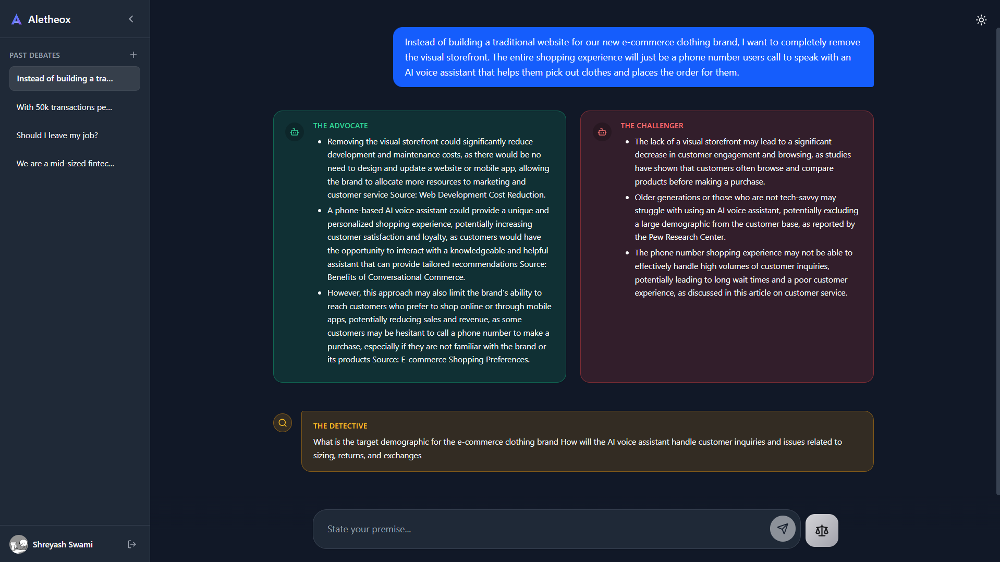
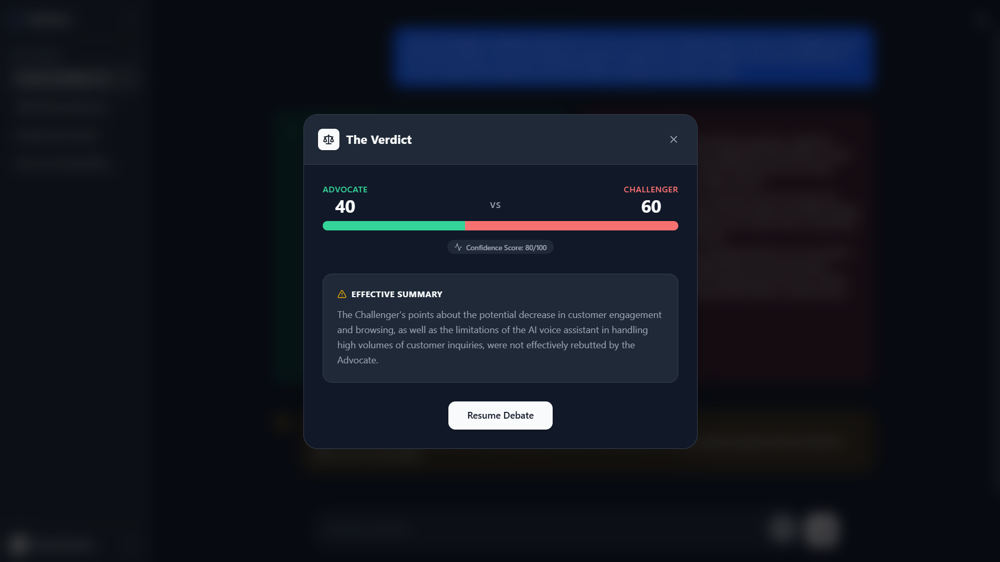

# Aletheox: Multi-Agent Decision Engine

Welcome to **Aletheox** (derived from "Aletheia," the Greek concept of truth, and "Paradox," representing opposing viewpoints). Aletheox is an advanced multi-agent decision engine designed to pressure-test ideas, strategies, and premises by generating structured debates between AI agents.

## Project Overview

When a user presents an idea or a premise, Aletheox orchestrates a structured, fact-grounded debate. It constructs compelling arguments for the idea, rigorously challenges its flaws, dynamically asks the user for missing context, and ultimately delivers a definitive, well-reasoned verdict on whether the user should proceed, pivot, or abandon the premise.

This project was developed as a comprehensive demonstration of advanced AI orchestration and state management for the Kaggle Capstone Project.

## Applied AI Concepts

This project implements several advanced AI engineering paradigms:

*   **Multi-Agent Orchestration:** Coordinated execution of specialized agents using LangGraph.
*   **Tools:** Grounding arguments in reality using tools like **Tavily Search** for real-time web retrieval.
*   **State Management:** Durable session and graph state persistence using PostgreSQL.
*   **Context Engineering:** Dynamic prompt adjustment and information gathering to reduce hallucinations.
*   **LLM-as-a-Judge:** Automated, objective evaluation and verdict generation based on agent debate history.

## Architecture

For a detailed breakdown of the agents, the backend orchestration, frontend stack, and the architecture diagram, please refer to the [ARCHITECTURE.md](./ARCHITECTURE.md) document.

---

## Setup Instructions

Follow these steps to run Aletheox locally.

### Prerequisites

*   [Docker Desktop](https://www.docker.com/products/docker-desktop/) (for the PostgreSQL database)
*   [Python 3.12+](https://www.python.org/) & [uv](https://docs.astral.sh/uv/) (Backend package manager)
*   [Node.js](https://nodejs.org/) & [pnpm](https://pnpm.io/) (Frontend package manager)

### 1. Start the Database

Aletheox uses PostgreSQL for state management. A `docker-compose.yml` file is provided in the root directory.

```bash
docker-compose up -d
```

### 2. Backend Setup

Navigate to the `backend` directory and set up the environment:

```bash
cd backend
```

Create a `.env` file based on the example:

```bash
cp .env.example .env
```

**⚠️ Important:** For examiners running this locally, you **MUST** provide the following environment variables in `backend/.env` for the AI to function:
1. `GEMINI_API_KEY` **OR** `GROQ_API_KEY` (At least one LLM key is required).
2. `ACTIVE_LLM_PROVIDER` (Set to `gemini` or `groq` depending on your key).
3. `TAVILY_API_KEY` (Required for the web search tools to work).

*(Note: The other variables like Google/GitHub OAuth, SMTP Email, or Cloudinary are **optional**. The app will run in guest/anonymous mode without them.)*

Install the dependencies and start the FastAPI server:

```bash
uv sync
uv run uvicorn main:app --reload
```

### 3. Frontend Setup

Navigate to the `frontend` directory:

```bash
cd frontend
```

Create a `.env` file based on the example (usually points to your backend URL `http://localhost:8000`):

```bash
cp .env.example .env
```

Install the dependencies and start the Vite development server:

```bash
pnpm install
pnpm dev
```

Visit the local URL provided by Vite (typically `http://localhost:5173`) to interact with Aletheox!

---

## Output

Input - "Instead of building a traditional website for our new e-commerce clothing brand, I want to completely remove the visual storefront. The entire shopping experience will just be a phone number users call to speak with an AI voice assistant that helps them pick out clothes and places the order for them."



Verdict after one iteration (it will keep iterating and refining the verdict based on the agent debate until the verdict is reached)


